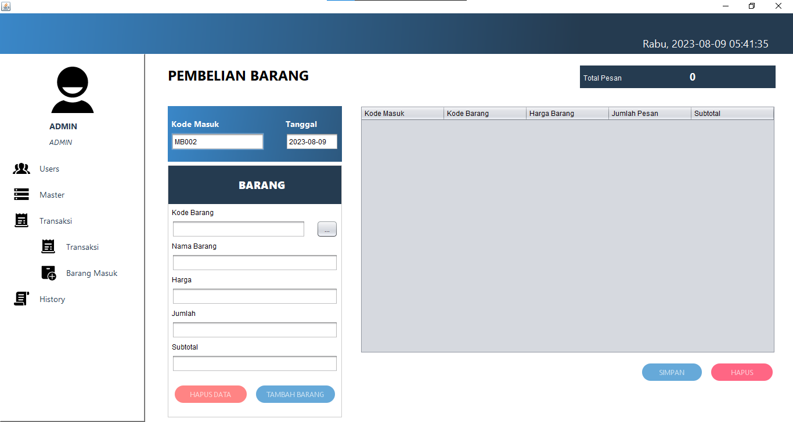

# MY BENGKEL
## TUGAS BESAR PEMROGRAMAN BERORIENTASI OBJECT (PBO)
Latar Belakang dalam pembuatan my bengkel adalah untuk memudahkan masyarakat yang mempunyai usaha bengkel dalam hal pembukuan, pembukuan yang sering kali dilakukan yaitu dengan menggunakan buku atau kertas, hal tersebut tidak efektif dan kurang aman karena kertas gampang rusak atau hilang maka dari itu kita membuat my bengkel. dengan hadirnya my bengkel data yang masuk akan disimpan ke dalam database dan tidak akan hilang serta data akan terlihat secara jelas dan terstruktur sehingga pengusaha bengkel dapat dengan mudah menganalisa pengeluaran atau pemasukan di usahanya.
### Login

### Home

### Transaksi

### Barang Masuk

### Ex Data
